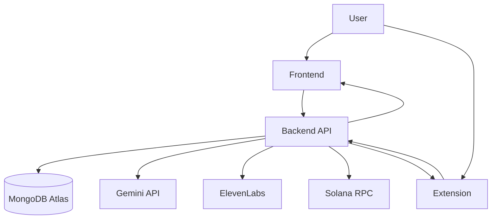

# Savant

Savant is a HackCU research assistant monorepo with three connected applications:

- a FastAPI backend for ingestion, retrieval, graph generation, persistence, and optional payment checks
- a Next.js frontend for upload, chat, citations, voice, and graph exploration
- a Chrome extension for paper-context extraction and side-panel concept trees

## Monorepo Layout

```text
HackCU_12--main/
├── apps/
│   ├── backend/
│   ├── frontend/
│   └── extension/
├── docs/
├── .github/
├── README.md
└── AGENTS.md
```

## Project Workflow



Short workflow docs:

- [docs/WORKFLOW.md](./docs/WORKFLOW.md)
- [docs/DETAILED_WORKFLOW.md](./docs/DETAILED_WORKFLOW.md)
- [docs/ARCHITECTURE.md](./docs/ARCHITECTURE.md)
- [docs/ROADMAP.md](./docs/ROADMAP.md)

## Canonical Paths

- Backend source of truth: `apps/backend`
- Frontend source of truth: `apps/frontend`
- Extension source of truth: `apps/extension`
- Canonical Vercel deployment root: `apps/frontend`
- Product roadmap and delivery status: `docs/ROADMAP.md`

## App Breakdown

- `apps/backend`: FastAPI backend
- `apps/frontend`: Next.js web app
- `apps/extension`: Vite/React Chrome extension

## Frontend Deployment

The canonical Vercel project root is `apps/frontend`.

Use this exact setup in Vercel:

- Framework Preset: `Next.js`
- Root Directory: `apps/frontend`
- Install Command: `npm ci`
- Build Command: `npm run build`

This repository no longer uses root-level Vercel compatibility wrappers or the
legacy `savant-frontend` deployment path. If preview deployments fail, first
verify the Vercel project is pointed at `apps/frontend`.

## Tech Stack

- Backend: Python, FastAPI, Motor, PyPDF2, httpx, Gemini, ElevenLabs
- Frontend: Next.js 16, React 19, TypeScript, Tailwind CSS
- Extension: Vite, React 18, TypeScript, Chrome Extensions Manifest V3
- Data: MongoDB Atlas vector search

## Environment Setup

Use the root [.env.example](./.env.example) as a consolidated reference, then configure the app-specific env files:

- `apps/backend/.env.example`
- `apps/frontend/.env.example`
- `apps/extension/.env.example`

## Local Development

### Backend

```bash
cd apps/backend
python -m venv venv
venv\Scripts\activate
pip install -r requirements.txt
uvicorn savant_backend.main:app --app-dir src --host 127.0.0.1 --port 8000 --reload
```

### Frontend

```bash
cd apps/frontend
npm install
npm run dev -- --hostname 127.0.0.1 --port 3000
```

### Extension

```bash
cd apps/extension
npm install
npm run build
```

Then open `chrome://extensions`, enable Developer Mode, choose `Load unpacked`, and select the built extension folder.

## Verification

- Backend tests: `cd apps/backend && python -m unittest discover -s tests -p "test*.py"`
- Frontend lint/typecheck: `cd apps/frontend && npm run lint && npm exec tsc -- --noEmit`
- Extension checks: `cd apps/extension && npm run typecheck && npm run build`
- Backend smoke flow: `cd apps/backend && pytest tests/test_api_flows.py -k smoke`

## What Lands In CI

- backend lint + test + smoke flow
- frontend test + lint + typecheck + build
- extension test + typecheck + build
- deployment assumption checks for the canonical frontend path

## Contributor Docs

- [AGENTS.md](./AGENTS.md)
- [CONTRIBUTING.md](./CONTRIBUTING.md)
- [docs/README.md](./docs/README.md)
