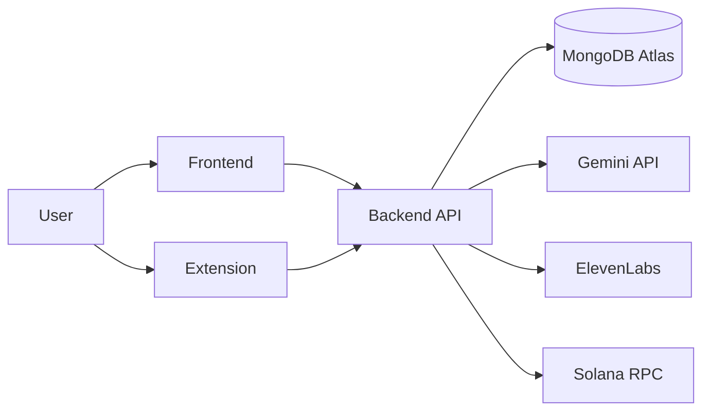

# Savant Detailed Workflow

This document is a deeper onboarding guide for new contributors, judges, and teammates who want to understand how the full HackCU project behaves step by step.

It complements:

- `docs/WORKFLOW.md` for the short, visual summary
- `docs/ARCHITECTURE.md` for the structural overview

## 1. Big Picture

Savant has three main surfaces:

1. `apps/frontend`
2. `apps/backend`
3. `apps/extension`

The backend is the central brain of the project. Both user-facing surfaces send requests to it.

### System Relationship

## 2. What Each Part Does

### `apps/frontend`

This is the main research workspace.

It is responsible for:

- uploading PDFs
- creating and restoring conversations
- sending paper questions to the backend
- showing answers, citations, telemetry, and voice output
- rendering the graph exploration experience

### `apps/backend`

This is the orchestration layer.

It is responsible for:

- receiving uploaded PDFs
- extracting and chunking text
- generating embeddings
- storing chunks and sessions in MongoDB
- retrieving relevant paper context for questions
- generating graph structures and use cases
- optionally checking Solana payment state
- optionally generating audio

### `apps/extension`

This is the lightweight browser side-panel.

It is responsible for:

- running on supported research websites
- extracting useful paper context from the page
- sending context to backend graph endpoints
- rendering a concept tree for quick exploration

## 3. End-to-End User Journeys

There are four main workflows in this project:

1. PDF upload and ingestion
2. Question answering over a paper
3. Graph extraction and graph exploration
4. Browser extension context-tree generation

---

## 4. Workflow A: PDF Upload and Ingestion

This workflow begins when a user uploads a PDF in the frontend.

### Step-by-Step

1. The user opens the web app.
2. The user chooses a PDF file in the upload control.
3. The frontend sends a `multipart/form-data` request to the backend `POST /upload` endpoint.
4. The backend receives the file and reads the PDF bytes.
5. The backend extracts page text from the PDF.
6. The backend normalizes the text and removes empty or unusable pages.
7. The backend splits the text into overlapping chunks so retrieval later works at a smaller unit than an entire page.
8. For each chunk, the backend requests an embedding from Gemini.
9. The backend builds chunk records containing:
   - `doc_id`
   - filename
   - page number
   - chunk index
   - raw text
   - embedding vector
10. The backend writes those records into MongoDB Atlas.
11. The backend returns document metadata to the frontend, including the new `doc_id`.
12. The frontend stores the uploaded filename and associated `doc_id` in the active conversation.
13. The frontend usually creates a session immediately after upload so later Q/A state can be persisted or shared.

### What This Produces

At the end of ingestion, the system has:

- a document identifier
- chunked text stored in MongoDB
- vector embeddings ready for retrieval
- frontend state tied to that uploaded paper

### Why This Matters

This is the foundation for every later feature. If ingestion fails, the user cannot:

- query the paper
- build a graph from the uploaded document
- save a meaningful paper session

---

## 5. Workflow B: Question Answering Over a Paper

This workflow begins when the user asks a question in the frontend after a document has been uploaded.

### Step-by-Step

1. The user types a question in the terminal-style chat UI.
2. The frontend sends a `POST /query` request to the backend.
3. The request usually includes:
   - `prompt`
   - `doc_id`
   - optional `page_number`
   - optional `session_id`
4. If payment gating is enabled, the backend checks whether the user has a valid payment for query access.
5. The backend generates an embedding for the user’s question.
6. The backend uses MongoDB Atlas vector search to retrieve the most relevant chunks for that `doc_id`.
7. If vector retrieval is weak or unavailable, the backend can use lexical fallback behavior.
8. The backend ranks or filters the candidate chunks.
9. The backend assembles a context window from the selected chunks.
10. The backend sends the prompt plus retrieved context into Gemini generation.
11. Gemini returns a synthesized answer grounded in the selected context.
12. The backend packages the response with:
   - `answer`
   - `citations`
   - retrieval context metadata
   - timing telemetry
   - optional audio data
13. If audio is enabled, the backend attempts ElevenLabs synthesis.
14. The frontend receives the response and updates the active conversation logs.
15. The frontend renders:
   - the answer
   - citations
   - telemetry
   - audio playback controls if audio was generated
16. The frontend also syncs the updated conversation state back to the backend.

### What the User Sees

The user sees:

- a natural-language answer
- evidence snippets from the paper
- timing metrics
- optional voice playback

### Important Design Detail

The answer is meant to come from retrieved paper context, not from unconstrained model knowledge. That is what makes this a paper-grounded assistant rather than a generic chatbot.

---

## 6. Workflow C: Conversation Persistence

This workflow handles saving and restoring the user’s chat state.

### Step-by-Step

1. The frontend creates or restores an active conversation.
2. Each conversation carries information such as:
   - title
   - logs
   - `doc_id`
   - filename
   - `session_id`
   - citations
   - telemetry
   - document metadata
3. The frontend keeps a local copy of this state in browser storage.
4. The frontend also syncs conversation state to the backend using conversation endpoints.
5. The backend stores the conversation snapshot in MongoDB.
6. When the app reloads, the frontend first tries to hydrate from backend state.
7. If backend hydration fails, the frontend falls back to local storage.
8. When a user renames or deletes a conversation, the frontend updates local state and also sends the change to the backend.

### Why This Matters

This gives the project a more persistent product feel:

- uploads are not just one-off demos
- chat state can survive reloads
- sessions can be revisited

---

## 7. Workflow D: Shareable Sessions

This is related to persistence, but it has its own purpose.

### Step-by-Step

1. After a paper is uploaded, the frontend may create a backend session.
2. The backend stores the session and issues a `session_id`.
3. The backend also creates a share token or share URL path.
4. The frontend builds a shareable URL using the backend response.
5. If the user copies or opens that shared link, the backend uses the share token to load the session state.

### What This Enables

- demoing the project to others
- sharing a specific paper interaction flow
- resuming a saved discussion

---

## 8. Workflow E: Graph Extraction From an Uploaded Paper

This workflow begins when the frontend wants to turn a paper into an interactive concept graph.

### Step-by-Step

1. The frontend already has a paper loaded or already knows the `doc_id`.
2. The frontend fetches the paper context or sends paper text to graph endpoints.
3. The backend sends the paper context to Gemini with graph-specific instructions.
4. The model returns a structure that the backend validates.
5. The backend normalizes the output into:
   - nodes
   - edges
   - categories
   - use cases
6. The backend returns the graph payload to the frontend.
7. The frontend renders the graph visually.
8. The user can click concepts and ask follow-up questions about a selected node or region of the graph.

### Why This Is a Separate Workflow

This is not just chat with a different UI. It is a different interaction mode:

- chat is linear and conversational
- graph mode is structural and exploratory

---

## 9. Workflow F: Chrome Extension Context-Tree Generation

This workflow is similar to graph exploration, but it starts from a live website instead of an uploaded PDF.

### Step-by-Step

1. The user navigates to a supported paper website.
2. The extension checks whether the current hostname is supported.
3. If supported, the side panel becomes available.
4. The user opens the extension side panel.
5. The extension extracts page context from the active tab.
6. It looks for:
   - title metadata
   - abstract metadata
   - content blocks in the page body
   - site-specific paper structure where available
7. The extension sends the extracted paper text to backend graph endpoints.
8. The backend returns graph nodes, edges, and use cases.
9. The extension renders the concept tree in the side panel.
10. If backend graph generation fails, the extension can build a local fallback graph from the extracted text.

### Why This Matters

This turns Savant into more than a file-upload app. It also works as a context assistant for live research browsing.

---

## 10. Data Flow Through MongoDB

MongoDB Atlas is the persistent memory layer of the system.

### Main Stored Data

- document chunks
- embeddings
- filenames and chunk metadata
- sessions
- session messages
- graph sessions
- graph messages
- frontend conversation snapshots
- payment verification records

### Typical Read Path

1. User asks a question.
2. Backend queries MongoDB for relevant chunks or stored state.
3. Backend combines retrieved information with model calls.
4. Backend returns the result to the requesting surface.

### Typical Write Path

1. User uploads a paper or changes conversation state.
2. Backend writes the new records to MongoDB.
3. Future retrieval or session restoration uses those stored records.

---

## 11. External Services and Why They Exist

### Gemini

Used for:

- embeddings
- answer generation
- graph extraction
- use-case generation

### ElevenLabs

Used for:

- turning answers into spoken audio

### Solana RPC

Used for:

- verifying payment state when query gating is enabled

### Browser Speech APIs

Used in the frontend for:

- speech recognition input
- browser TTS fallback when ElevenLabs audio is unavailable

---

## 12. Step-by-Step Local Startup Workflow

This is the easiest way for a new developer to understand the project in practice.

### Backend Startup

1. Enter `apps/backend`
2. Create a Python virtual environment
3. Install dependencies
4. Add `.env`
5. Start FastAPI with Uvicorn

### Frontend Startup

1. Enter `apps/frontend`
2. Install Node dependencies
3. Add `.env.local`
4. Start the Next.js dev server
5. Open the frontend in a browser

### Extension Startup

1. Enter `apps/extension`
2. Install Node dependencies
3. Add `.env`
4. Build the extension
5. Open `chrome://extensions`
6. Enable developer mode
7. Load the built `dist/` folder

### First Manual End-to-End Test

1. Start the backend
2. Start the frontend
3. Upload a PDF
4. Ask a question
5. Check that citations and telemetry appear
6. Trigger graph generation
7. Open a supported paper site
8. Test the extension side panel

---

## 13. How Ownership and Session State Work

The system uses lightweight ownership tracking to separate saved state.

### Step-by-Step

1. The frontend creates or reuses a local owner token.
2. That token is sent in request headers to the backend.
3. The backend uses that owner identifier to scope:
   - conversations
   - sessions
   - saved state lookups
4. Public sharing flows are handled separately with share tokens.

### Why This Exists

This is a lightweight boundary to avoid mixing one user’s saved state with another’s, even before a full authentication system is introduced.

---

## 14. Failure and Fallback Paths

The project includes several pragmatic fallback behaviors because it was built as a fast-moving prototype.

### Retrieval Fallback

If embeddings or vector retrieval are weak, the backend can still use lexical fallback logic.

### Audio Fallback

If ElevenLabs audio fails, the frontend can use browser TTS.

### Extension Graph Fallback

If graph extraction fails in the extension flow, a local fallback graph can still be created.

### Storage Fallback

If backend conversation sync fails, the frontend still keeps local conversation state.

---

## 15. How a New Contributor Should Read the Codebase

If someone is brand new to the repo, this is a good order:

1. Read `README.md`
2. Read `docs/WORKFLOW.md`
3. Read this file
4. Read `docs/ARCHITECTURE.md`
5. Open `apps/backend/src/savant_backend/main.py`
6. Open the backend router and service files
7. Open `apps/frontend/src/app/page.tsx`
8. Open `apps/frontend/src/components/SavantTerminal.tsx`
9. Open `apps/frontend/src/components/PaperGraphExplorer.tsx`
10. Open `apps/extension/src/background.ts`

---

## 16. Mental Model Summary

If you want one sentence that explains the whole project:

Savant is a paper-grounded research assistant where the frontend and extension collect or display research context, while the backend ingests, retrieves, reasons over, stores, and transforms that context into answers, graphs, sessions, and voice responses.
