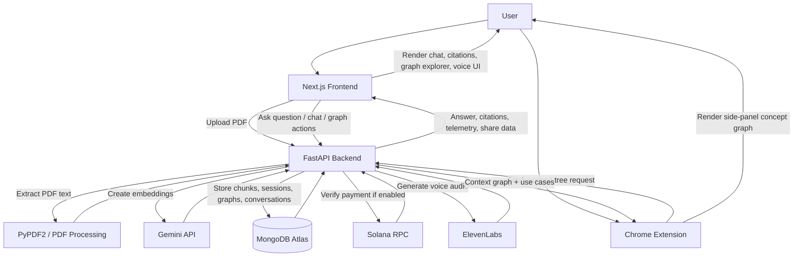

# Savant Workflow

This document shows how the Savant HackCU project works end to end across the frontend, backend, database, third-party services, and Chrome extension.

## Full Project Workflow

## Main User Journeys

### 1. Paper Upload and Chat

1. User uploads a PDF from the frontend.
2. The backend extracts page text and splits it into chunks.
3. The backend creates embeddings through Gemini.
4. Chunks and metadata are stored in MongoDB Atlas.
5. The frontend receives a `doc_id` and creates or updates a session.
6. User asks questions about the uploaded paper.
7. The backend retrieves the most relevant chunks, generates an answer, and returns citations plus telemetry.
8. If audio is available, the response is played through ElevenLabs or browser TTS fallback.

### 2. Graph Exploration

1. A paper is uploaded in the web app or opened on a supported research site in the extension.
2. The frontend or extension sends paper context to the backend graph endpoints.
3. The backend generates graph nodes, edges, and practical use cases.
4. The result is visualized as an interactive concept graph.

### 3. Session Persistence and Sharing

1. The frontend stores chat and graph state per owner.
2. The backend persists sessions, messages, and conversation snapshots.
3. A share token can be generated for session sharing flows.

## Component Responsibilities

- `apps/frontend`: Main research cockpit for uploads, QA, graph exploration, citations, and voice.
- `apps/backend`: API orchestration layer for ingestion, retrieval, graph generation, persistence, and optional payment checks.
- `apps/extension`: Lightweight side panel for supported research websites that turns live paper context into a concept tree.
- `MongoDB Atlas`: Stores embeddings, chunked documents, sessions, and chat state.
- `Gemini API`: Embeddings and generation.
- `ElevenLabs`: Audio synthesis.
- `Solana RPC`: Optional query-payment verification.
